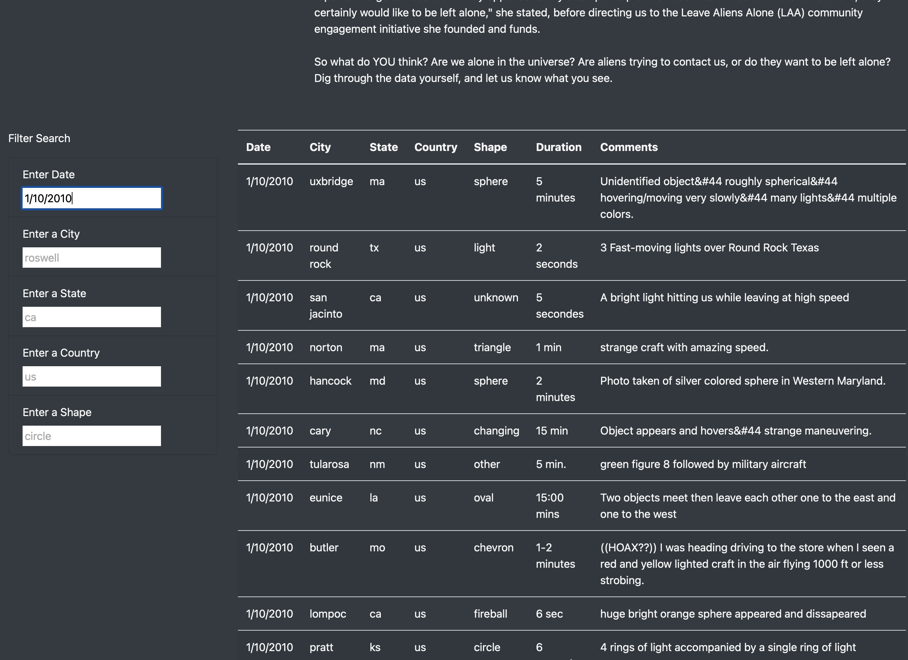
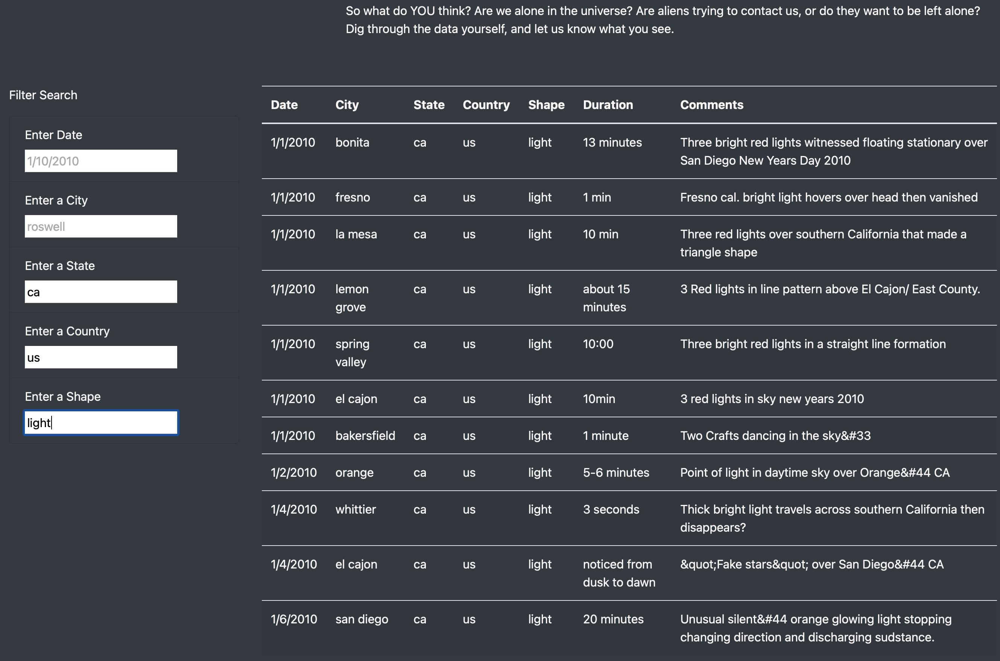
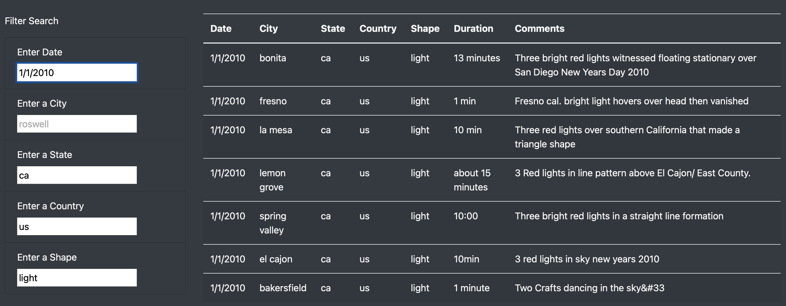

# UFO Sightings with JavaScript

## Project Roadmap
In this project we use JavaScript, HTML, and CSS to create a custom webpage that will showcase different UFO sightings around the world. I help Dana create a webpage to show UFO sightings across the US. The webpage has various filters for users to find UFO data that may be of interest to them using their text input. We took data from a JavaScript file in JSON format and linked it with our web page to provide the data.

## Tasks
- Create a webpage to showcase UFO sight data.
- Create input text fields and filters for user input.
- Use bootstrap, HTML, and CSS to format the webpage.
- Use JavaScript functions and loops to filter user input and display specific data.
- Make the webpage accessible through Github Pages.
## Results
The webpage is simple and easy to use, simply visit the webpage, head down to the search boxes. Input filter criteria by date, city name, state, country, and or shape. You can search by one filter criteria, multiple criteria or all criteria.

## Summary
I think the filter input boxes should span across the top of the page as a nav bar would and have the search results span across the full page width. I think that would give the webpage a much cleaner look and a much more flawless user experience. I think the different layout would decrease the amount of whitespace that remains empty, as you scroll down the page there is about 20% of the screen that remains unused. Either set the search box to a fixed position so it is always available or just span both the results and search box to 100%. I think it is an okay web page but it is not fun to scroll down thousands of results and then back up again. We can also set the search results box to scrollable and give it a fixed width and height so the user still has room to scroll the webpage without having to scroll through all the results.
## Technologies and Tools Used
- Visual Studio Code
- Google
- JavaScript
- D3.js
- Bootstrap
- CSS
- HTML
- Github
- Zsh Terminal
- Github Pages